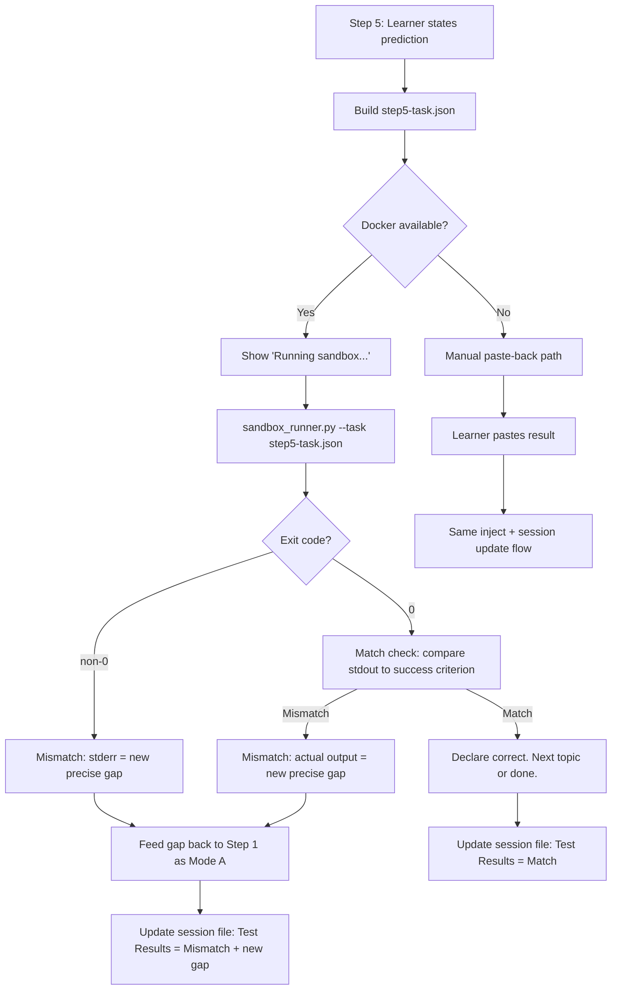

# AI Learning Lab Agent — v1 Sandbox Execution for Step 5

## Summary

Extend the `learn-anything` skill so that Step 5 (Apply & Test) closes automatically
inside Claude Code: Claude Code constructs a minimal test scaffold from the learner's
prediction, runs it in an isolated Docker container, and injects the verdict back into
the conversation. The learner never leaves the session to test their prediction.

---

## Problem Frame

Learners using the Specificity Method reach Step 5 with a concrete prediction ("I predict
that if I call `asyncio.gather()` on two coroutines, they run concurrently, not sequentially")
but must break out of Claude Code to verify it. The context switch is high enough that most
learners skip Step 5 entirely — they "feel" like they understood but never prove it. The same
gap resurfaces weeks later in production.

The required interface change is small: add a Docker subprocess call inside Step 5, controlled
by the existing SKILL.md instruction layer. No new Claude Code skill is needed. No new server.

---

## Key Technical Decisions

KTD1. **Docker subprocess over OpenHands CLI.** The requirements doc assumed `openhands run --task <file>`. The current OpenHands (1.x) removed the headless CLI and replaced it with a server-only architecture; no `openhands run` command exists. Direct Docker subprocess achieves the same isolation more simply and without an OpenHands install. OpenHands MCP server remains the v2 upgrade path. (see origin: R2, OQ1)

KTD2. **Claude Code orchestrates execution.** SKILL.md instructs Claude Code to write the scaffold, run Docker via the Bash tool, and read the result — no intermediate Python wrapper is required for the orchestration layer itself. `sandbox_runner.py` handles only the Docker call, error wrapping, and JSON result serialization so SKILL.md instructions stay readable.

KTD3. **Ephemeral sandbox directory per session.** Scaffold files live at `/tmp/learn-sandbox/{session-slug}/`. This directory is created at Step 5 entry and deleted after result is read. Writing to `~/Documents/Learning/` is reserved for the session file; temp sandbox artifacts do not belong there.

KTD4. **60-second timeout with upfront status message.** Docker startup adds ~3-5 s; simple scripts finish in under 15 s total. The skill shows "Running sandbox..." before invoking Docker so the learner knows to wait. Any run exceeding 60 s is killed and treated as a mismatch for session-file purposes.

KTD5. **Technology context drives image selection.** Five context types, detected from Step 2 topic tags: Python (`python:3.12-slim`), JavaScript/Node (`node:20-slim`), SQL/SQLite (`python:3.12-slim` with stdlib `sqlite3`), Claude Code skills (`python:3.12-slim` with subprocess), Bash (`alpine:3.20`). User can override at session start with `/learn-anything python: <topic>`.

KTD6. **Graceful degradation detected at session start.** The skill checks for Docker availability with `docker info` when the session begins, not at Step 5. A missing Docker or daemon stops the capability silently and offers the manual paste-back path — the learner is never surprised mid-session.

---

## Requirements

**Sandbox construction**

- R1. Step 5 must produce a structured `step5-task.json` containing: the learner's prediction (verbatim), detected technology context, the minimal scaffold (code to execute), and a success criterion (how to evaluate pass vs fail).
- R2. The scaffold must be written to `/tmp/learn-sandbox/{session-slug}/` before Docker is invoked.

**Execution**

- R3. Docker must run with `--rm`, `--network none`, `--memory 512m`, a 60-second timeout, and the sandbox directory mounted at `/workspace`.
- R4. The selected image must match the detected technology context (see KTD5).

**Result injection**

- R5. After Docker completes, the skill reads the exit code and stdout/stderr and injects a verdict into the conversation: "Your prediction was correct" on match, "Your prediction didn't match" on mismatch, with actual output shown in both cases.
- R6. A mismatch feeds back into Step 1 as a named Mode A gap — the mismatch output becomes the new specific gap, not a generic retry prompt.
- R7. The `## Test Results` block in the session file must be populated with: Predicted / Got / Match / What it taught us.

**Technology detection**

- R8. The skill infers technology context from the topic tags surfaced during Step 2. Detection order: explicit override tag (`python:`, `js:`, `sql:`, `bash:`) > Step 2 topic tags > fallback Bash.

**Degradation**

- R9. Docker availability is checked at session start via `docker info`; if unavailable, the skill offers the manual paste-back path immediately and does not attempt Docker at Step 5.
- R10. Manual paste-back must accept a result and trigger the same R5/R6/R7 flow as the Docker path.

---

## High-Level Technical Design



---

## Scope Boundaries

**In scope (v1)**

- SKILL.md Step 5 instruction update
- `sandbox_runner.py` Docker wrapper
- Technology context detection inline in SKILL.md
- Graceful degradation (Docker check at session start)
- Step 1 re-entry when prediction mismatches
- Session file `## Test Results` population

**Deferred to v2**

- OpenHands MCP server delegation (Approach C)
- Per-domain sandbox skill files (`.agents/skills/learn-sandbox-*.md`)
- Concurrent sandbox sessions (one OpenHands instance, N learners)
- L&D team layer: org-level gap visibility, cohort dashboards
- Persistent sandbox state across Step 5 calls within a session

---

## Implementation Units

### U1. Update SKILL.md Step 5 section

**Goal:** Replace the manual Step 5 test-loop prose with the sandbox delegation protocol, covering: Docker availability check announcement at session start, `step5-task.json` construction, `sandbox_runner.py` invocation, result injection into conversation, mismatch re-entry logic, and session file update.

**Files:**
- `~/.claude/skills/learn-anything/SKILL.md` — Step 5 and Context Push sections; Docker preflight note in Step 0

**Patterns to follow:**
- The existing Step 0–4 sections in SKILL.md for prose style and instruction depth
- Context Push section in SKILL.md for session file write instructions

**Test scenarios (conversational flow — verified manually):**
- Learner states prediction; Claude Code constructs `step5-task.json`, shows "Running sandbox...", runs `sandbox_runner.py`, shows verdict. Session does not require copy-pasting to a terminal.
- Docker unavailable at session start; skill announces manual path; learner pastes result; session file is updated normally.
- Mismatch: actual output differs from prediction; the mismatch text is offered as a Mode A gap for Step 1; no generic "try again" prompt.
- Step 5 is reached after a topic override (`/learn-anything sql: window functions`); the SQLite image is used without asking.

### U2. Create sandbox_runner.py

**Goal:** Minimal Docker subprocess wrapper. Reads `step5-task.json`, selects the Docker image, builds the `docker run` command, executes with timeout, and writes a `step5-result.json` with exit code, stdout, and stderr.

**Files:**
- `~/.claude/skills/learn-anything/scripts/sandbox_runner.py` (new file)

**Interface:**
```
python3 sandbox_runner.py --task /tmp/learn-sandbox/{slug}/step5-task.json
```

Writes `step5-result.json` to the same directory. Exits 0 on any completed run (Docker success or failure); exits non-zero only if Docker itself is not callable. SKILL.md reads `step5-result.json` via the Bash tool.

**Input schema (step5-task.json):**
```json
{
  "slug": "string",
  "prediction": "string",
  "tech_context": "python | js | sql | bash | claude-code",
  "scaffold": "string (code to execute)",
  "success_criterion": "string (how to evaluate output)"
}
```

**Output schema (step5-result.json):**
```json
{
  "exit_code": 0,
  "stdout": "string",
  "stderr": "string",
  "timed_out": false,
  "docker_error": null
}
```

**Image map (KTD5):**
| tech_context | Docker image |
|---|---|
| `python` | `python:3.12-slim` |
| `js` | `node:20-slim` |
| `sql` | `python:3.12-slim` |
| `claude-code` | `python:3.12-slim` |
| `bash` | `alpine:3.20` |

**Test scenarios:**
- Python script that prints `"hello"` → `exit_code: 0`, `stdout: "hello\n"`, `stderr: ""`
- Python script that raises `ValueError` → `exit_code: 1`, `stderr` contains traceback
- Script that runs longer than 60 s → `timed_out: true`, partial stdout if any
- `docker` binary not on PATH → `docker_error: "docker not found"`, exits non-zero
- Network access attempt from inside container → connection refused (enforced by `--network none`)
- SQL scaffold using `import sqlite3` in `python:3.12-slim` → runs without installing anything

---

## Risks & Dependencies

| Risk | Likelihood | Mitigation |
|---|---|---|
| Learner machine has no Docker | Medium | Detected at session start (KTD6); manual path offered |
| Docker image pull on first run adds 30-60 s | Low | Plan text recommends pre-pulling common images (`docker pull python:3.12-slim`) in the skill's setup note |
| Scaffold written by Claude Code has a syntax error | Medium | Non-zero exit code → treated as mismatch + new gap; no special handling needed |
| Docker daemon memory limits block container | Low | `--memory 512m` is conservative; 512 MB fits most learning scaffolds |
| `sandbox_runner.py` Python not available | Very low | Claude Code shell has Python 3.x; script uses stdlib only (`subprocess`, `json`, `pathlib`) |

---

## Sources

- Brainstorm requirements doc: `docs/brainstorms/2026-06-18-ai-learning-lab-agent-requirements.md`
- OQ1 research: OpenHands 1.x removed headless CLI; current repo (`All-Hands-AI/OpenHands`) has `openhands/app_server/` server-only architecture; `pyproject.toml` shows version `1.8.0` with `openhands-sdk==1.28.0` dependency but no CLI entry points
- OQ2 research: Docker Hub official images; `python:3.12-slim` includes stdlib `sqlite3`, `subprocess`, `json` — no pip install needed for basic scaffolds
- learn-anything SKILL.md Step 5 section: `~/.claude/skills/learn-anything/SKILL.md` lines 390-420
