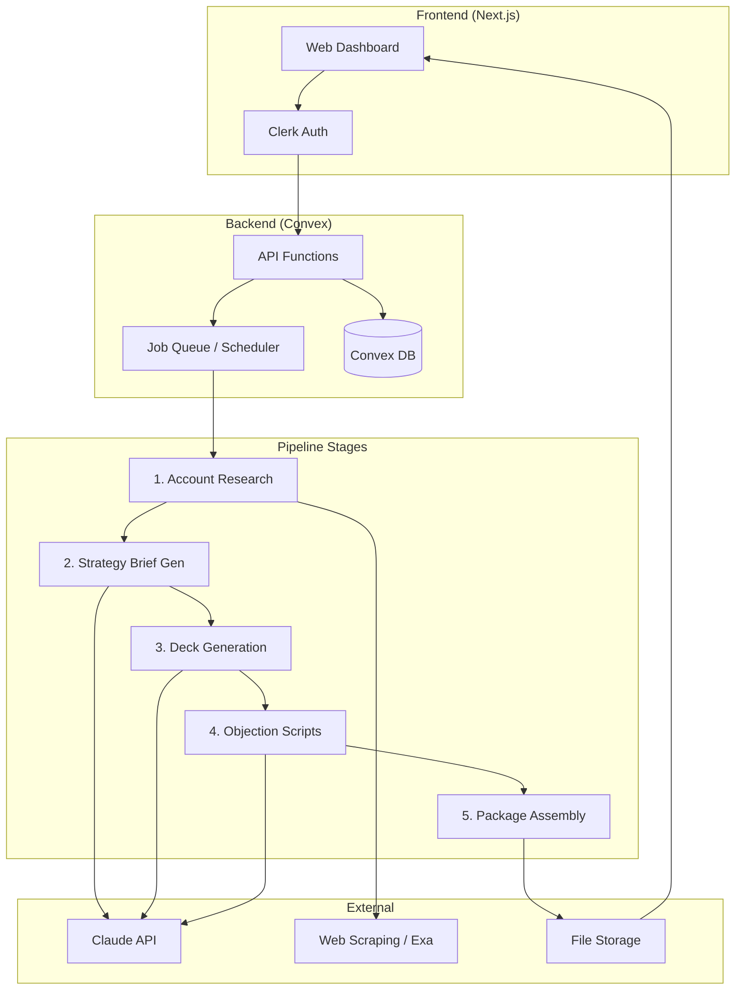

# PRD — DealForge

## Overview

**Product:** DealForge  
**One-liner:** AI-powered pre-sales copilot that turns a prospect name into a complete deal-prep package in minutes.  
**Objective:** Reduce AI consultant pre-sales prep time from 4-8 hours to under 30 minutes per deal.  
**Differentiation:** 5-stage consulting-grade pipeline with quality gates — not generic slide generation.  
**Magic moment:** Enter a company name, get a branded deal-prep package 90 seconds later.

**Success criteria:**
- 5 paying customers within 90 days
- >70% of generated packages used in actual client meetings
- >3 hours saved per deal (measured via user survey)

---

## Technical Architecture

### Architecture Overview



### Stack Table

| Layer | Choice | Rationale |
|---|---|---|
| Frontend | Next.js (App Router) | SSR, API routes, TypeScript |
| Backend | Convex | Real-time, job scheduling, TypeScript e2e |
| Database | Convex Database | Built-in, schema validation, reactive queries |
| Auth | Clerk | Drop-in, social login, org support for teams later |
| Payments | Polar | Developer-first subscriptions, usage billing |
| AI | Claude API (Anthropic SDK) | Best quality for long-form generation |
| Search | Exa API | Structured web search for prospect research |
| File Gen | python-pptx (via serverless function) | Branded .pptx generation |

### Repo Structure

```
dealforge/
├── app/                    # Next.js app router
│   ├── (auth)/            # Auth pages (Clerk)
│   ├── dashboard/         # Main dashboard
│   ├── deal/[id]/         # Deal detail + outputs
│   └── settings/          # Brand settings, profile
├── convex/                # Convex backend
│   ├── schema.ts          # Database schema
│   ├── deals.ts           # Deal CRUD
│   ├── pipeline.ts        # Pipeline orchestration
│   ├── stages/            # Individual stage functions
│   │   ├── research.ts
│   │   ├── brief.ts
│   │   ├── deck.ts
│   │   ├── objections.ts
│   │   └── package.ts
│   └── auth.config.ts     # Clerk integration
├── components/            # React components
├── lib/                   # Shared utilities
│   ├── ai.ts             # Claude API wrapper
│   ├── search.ts         # Exa API wrapper
│   └── pptx.ts           # Deck generation bridge
├── public/               # Static assets
└── templates/            # Deck templates
    └── default.pptx      # Base branded template
```

---

## Data Model

### Entities

**User**
| Field | Type | Notes |
|---|---|---|
| clerkId | string | Primary key, from Clerk |
| name | string | Display name |
| company | string? | Consulting firm name |
| brandSettings | object | Logo URL, colors, footer text |
| plan | enum | free / pro / team |
| createdAt | datetime | |

**Deal**
| Field | Type | Notes |
|---|---|---|
| id | auto | Convex document ID |
| userId | ref(User) | Owner |
| prospectName | string | Company name input |
| prospectIndustry | string? | Optional industry hint |
| useCase | string? | Optional use case focus |
| status | enum | pending / running / completed / failed |
| pipelineProgress | number | 0-5 (which stage) |
| createdAt | datetime | |
| completedAt | datetime? | |

**StageOutput**
| Field | Type | Notes |
|---|---|---|
| id | auto | |
| dealId | ref(Deal) | |
| stage | enum | research / brief / deck / objections / package |
| status | enum | pending / running / completed / failed |
| output | object | Stage-specific structured output |
| qualityScore | number? | 1-5 self-assessed quality |
| startedAt | datetime | |
| completedAt | datetime? | |
| error | string? | Error message if failed |

**Package**
| Field | Type | Notes |
|---|---|---|
| id | auto | |
| dealId | ref(Deal) | |
| briefUrl | string | Storage URL for brief PDF |
| deckUrl | string | Storage URL for .pptx |
| objectionsUrl | string | Storage URL for objection doc |
| zipUrl | string | Storage URL for combined package |
| createdAt | datetime | |

---

## API Specification

### Deals

**Create Deal**
- `POST /api/deals`
- Body: `{ prospectName: string, prospectIndustry?: string, useCase?: string }`
- Response: `{ dealId: string, status: "pending" }`
- Auth: Required

**Get Deal**
- `GET /api/deals/:id`
- Response: `{ deal: Deal, stages: StageOutput[], package?: Package }`
- Auth: Required (owner only)

**List Deals**
- `GET /api/deals`
- Response: `{ deals: Deal[] }`
- Auth: Required

**Download Package**
- `GET /api/deals/:id/download`
- Response: Redirect to signed URL for zip file
- Auth: Required (owner only)

---

## User Stories

1. **As a** solo AI consultant, **I want to** enter a prospect company name and get a complete deal-prep package **so that** I can walk into my next meeting fully prepared in 30 minutes instead of 4 hours.
   - AC: Input a company name → receive briefing + deck + objection scripts within 5 minutes

2. **As a** consultant preparing for a meeting, **I want to** download an editable .pptx deck **so that** I can customize it with my own additions before the meeting.
   - AC: Downloaded .pptx opens cleanly in PowerPoint/Keynote with no repair prompts

3. **As a** user with a specific use case in mind, **I want to** specify a focus area (e.g., "predictive quality") **so that** the strategy brief and deck are tailored to that use case, not generic AI opportunities.
   - AC: Specifying a use case produces materially different output than leaving it blank

4. **As a** consultant whose prospect has limited public data, **I want** the tool to flag thin data sections **so that** I know where to add my own research before the meeting.
   - AC: Sections with low-confidence data are visually flagged with a note

5. **As a** paying subscriber, **I want to** see my deal history and re-run previous prospects with updated inputs **so that** I can iterate on my prep over time.
   - AC: Dashboard shows all past deals with status, date, and re-run button

---

## Functional Requirements

| ID | Feature | Priority | Acceptance Criteria |
|---|---|---|---|
| FR-001 | Prospect name input with optional industry/use case | P0 | Single text input + two optional fields; starts pipeline on submit |
| FR-002 | Account research stage | P0 | Queries Exa API + web scraping; produces structured company profile |
| FR-003 | Strategy brief generation | P0 | Uses company profile + industry context; produces 1-page markdown brief |
| FR-004 | Branded deck generation | P0 | Produces 10-12 slide .pptx using python-pptx; passes validation |
| FR-005 | Objection script generation | P0 | Produces top 5 objections with responses and coaching notes |
| FR-006 | Package assembly + download | P0 | Bundles brief (PDF) + deck (.pptx) + objections (.md) into zip |
| FR-007 | Pipeline progress indicator | P0 | Real-time stage progress (1/5, 2/5...) via Convex subscriptions |
| FR-008 | Deal history dashboard | P1 | Lists all deals with status, date, download link |
| FR-009 | Brand settings (logo, colors) | P1 | Upload logo + set brand colors; applied to all future decks |
| FR-010 | Re-run deal with modified inputs | P1 | Edit inputs on existing deal → regenerate all outputs |
| FR-011 | Quality flag on thin data | P1 | Sections with low-confidence data flagged visually |
| FR-012 | Subscription management via Polar | P1 | Subscribe, upgrade, cancel via billing portal |

---

## Non-Functional Requirements

| Area | Requirement | Threshold |
|---|---|---|
| Performance | Full pipeline completion | < 3 minutes for 95th percentile |
| Performance | Dashboard page load | < 2 seconds |
| Availability | Uptime | 99.5% monthly |
| Security | Data isolation | Users can only access their own deals |
| Security | API auth | All endpoints require valid Clerk session |
| Security | File storage | Signed URLs with 1-hour expiration |
| Accessibility | WCAG | 2.1 AA compliance for all UI |
| Scalability | Concurrent pipelines | Support 10 simultaneous pipeline runs |

---

## UI/UX Requirements

### Dashboard (main screen)
- **Empty state:** Centered CTA — "Enter a prospect name to generate your first deal package"
- **Populated:** Card grid of past deals (prospect name, date, status badge, download button)
- **Loading:** Skeleton cards while data loads

### New Deal (modal or page)
- Prospect name (required, text input, autofocus)
- Industry (optional, dropdown with top 10 + "Other")
- Use case focus (optional, text input, placeholder: "e.g., predictive quality, customer churn")
- "Generate Package" button (primary CTA)

### Pipeline Progress (deal detail page)
- 5-step progress bar with stage names
- Current stage highlighted with spinner
- Completed stages show green check + preview toggle
- Failed stage shows red X + error message + retry button

### Package Ready (deal detail page — completed state)
- Three output cards: Brief, Deck, Objections
- Each card: preview snippet + individual download button
- "Download All" button (zip)
- "Re-run" button (returns to input form with fields pre-filled)

---

## Auth Implementation (Clerk)

- Sign up / sign in via Clerk Hosted UI
- Social login: Google, GitHub
- Session management via Clerk middleware in Next.js
- Convex auth via `@clerk/clerk-react` + Convex Clerk integration
- User record created in Convex on first sign-in (webhook or `onUserCreated`)

---

## Payment Integration (Polar)

- Plans: Free (2 deals/month), Pro ($300/month, unlimited)
- Polar checkout via redirect from pricing page
- Webhook on subscription change → update user plan in Convex
- Usage tracking: count deals per billing period, enforce free tier limit
- Billing portal link in settings for plan management

---

## Edge Cases & Error Handling

| Scenario | Behavior |
|---|---|
| Prospect company not found (no web results) | Return partial package with "limited data" flags; don't fail silently |
| Pipeline stage fails mid-run | Mark stage as failed, show error, offer retry for that stage only |
| Claude API rate limit hit | Queue with exponential backoff; show "processing" to user |
| Exa API returns no results | Fall back to basic web search; flag output as "limited research" |
| User downloads while pipeline running | Only show download for completed stages; disable zip until all done |
| .pptx generation fails validation | Retry once; if still fails, generate PDF fallback and flag |
| Concurrent pipeline runs by same user | Allow up to 3 simultaneous; queue beyond that |

---

## Dependencies & Integrations

| Service | Purpose | Notes |
|---|---|---|
| Anthropic Claude API | LLM for brief, deck content, objections | claude-sonnet-4-20250514 for speed; opus for quality-critical |
| Exa API | Structured web search for prospect research | `api.exa.ai/search` |
| Convex | Backend, DB, job scheduling, file storage | `convex.dev` |
| Clerk | Auth, user management | `clerk.com` |
| Polar | Subscription payments | `polar.sh` |
| python-pptx | .pptx generation | Via serverless Python function or API route |

---

## Out of Scope

- CRM integrations (Salesforce, HubSpot)
- Team/org features and shared deal libraries
- Template editor (custom slide layouts)
- Meeting recording or transcription analysis
- Follow-up email automation
- Mobile app
- Offline mode
- Multi-language support

---

## Open Questions

1. **Python-pptx in serverless:** Convex doesn't run Python natively. Options: (a) separate Python microservice on Railway/Fly, (b) Next.js API route with child_process, (c) WASM-based pptx lib in JS. Decision needed before build.
2. **Exa API pricing at scale:** Free tier may not cover 50+ deals/month. Need to model cost per deal and factor into pricing.
3. **Deck branding onboarding:** How much brand setup is required before first use? Minimal (logo + 2 colors) vs. full (template upload). Trade-off: time-to-magic-moment vs. output quality.
